# Arquitetura das skills

Este documento define o padrão aplicado à biblioteca inteira. Ele separa o
contrato curto que orienta o agente, o material de apoio que orienta a
execução e os metadados usados para descoberta.

## As três camadas

Cada diretório `skills/inboundfy-*/` contém:

```text
skills/inboundfy-<nome>/
├── SKILL.md
├── REFERENCIA.md
├── references/              # quando a skill agrupa etapas ou domínios
└── agents/
    └── openai.yaml
```

`SKILL.md` responde às perguntas de execução: quando ativar, quais fontes ler,
qual entrada aceitar, quais passos seguir, onde salvar o resultado, como
validar e o que preservar. A seção `Arquitetura de execução` aponta para os
blocos compartilhados e registra o grupo da skill.

`REFERENCIA.md` transforma o contrato em material de uso. Toda referência
contém template, exemplo completo marcado como ilustrativo, checklist binário,
erros comuns, campos do grupo, perguntas de conferência e referências internas.
As referências internas pertencem ao framework e não são skills instaláveis.

`agents/openai.yaml` contém a interface exposta ao agente. O prompt usa o ID
da skill com `$`, o nome visível começa com `Inboundfy` e o resumo informa a
função. Metodologia e contexto continuam no Markdown; o YAML apenas facilita
descoberta e ativação.

## Blocos compartilhados

`skills/_shared/` concentra regras que não devem ser reescritas em cada uma das
114 skills:

| Arquivo | Função |
| --- | --- |
| `01-preflight-e-fontes.md` | Confere sentinelas e fontes locais. |
| `02-contrato-de-artefato.md` | Define ID, estado, origem e vínculos. |
| `03-interacao-e-handoff.md` | Organiza escolhas e entrega entre skills. |
| `04-validacao-e-retomada.md` | Define retorno, histórico e aprovação. |
| `05-contexto-editorial.md` | Aplica voz, personas e regras de texto. |

O bloco comum é referência operacional. A skill ainda precisa manter no seu
próprio `SKILL.md` as regras que só valem para seu domínio.

## Grupos e perfis

O arquivo `skills/catalogo.json` é a fonte estruturada para quantidade e busca.
Na versão atual, os 114 IDs estão distribuídos assim:

| Grupo | Quantidade | Resultado típico |
| --- | ---: | --- |
| Orquestrador | 1 | Pacote coordenado e próxima ação. |
| Entrada | 2 | Preparação, setup ou encaminhamento inicial. |
| Acervo | 4 | Bruto, processado, FAQ, pesquisa e base editorial. |
| Base | 5 | Função reutilizável sem canal próprio. |
| Contexto | 7 | Arquivo canônico do domínio atualizado. |
| Brainstorm | 1 | Skill pública com cinco referências internas. |
| Copy | 6 | Redação, edição, oferta, persuasão e posicionamento. |
| Estratégia | 1 | Skill pública com quatro referências internas. |
| Growth | 25 | Aquisição, ativação, retenção, distribuição e otimização. |
| Planejamento | 1 | Skill pública com sete referências internas. |
| Especialista | 20 | Asset final do canal. |
| Validador | 20 | Relatório aprovado ou retorno para ajuste. |
| Qualidade | 2 | Revisão anti-slop para texto ou código. |
| Capacidade | 19 | Análise, plano ou registro consumível. |

Cada entrada do catálogo possui:

```json
{
  "id": "inboundfy-especialista-blog",
  "grupo": "especialista",
  "skill": "skills/inboundfy-especialista-blog/SKILL.md",
  "referencia": "skills/inboundfy-especialista-blog/REFERENCIA.md",
  "interface": "skills/inboundfy-especialista-blog/agents/openai.yaml",
  "perfil": {
    "entrada": "brief aprovado, acervo, persona, voz e template do canal",
    "saida": "asset final do canal em pasta própria com README",
    "validacao": "formato do canal, contexto editorial, fontes e revisão pareada",
    "handoff": "validadora do mesmo sufixo, seguida do pipeline"
  }
}
```

O perfil é uma ficha de pareamento. Ele não substitui a descrição específica
da skill nem autoriza uma etapa que não esteja no fluxo.

## Encadeamento operacional

O diagrama mostra o fluxo padrão para uma entrada nova. `inboundfy-iniciar` é
um atalho opcional. `inboundfy` coordena o percurso, e
`inboundfy-acervo` mantém a ordem das fases do item. Os nós em verde
representam arquivos ou diretórios do projeto consumidor, não skills do
framework.

Os nós A0 a A6 são ciclos distintos de `inboundfy-anti-slop`. A0 preserva a
origem, A1 confere o processado, A2 confere a base, A3 confere estratégia e
brief, A4 confere o início da redação, A5 confere a peça completa e A6 confere
o conjunto depois da validação individual.

```mermaid
flowchart TD
    entrada(["Pedido, ideia ou material"]) --> iniciar["inboundfy-iniciar<br/>atalho opcional"]
    entrada -. "entrada direta" .-> orquestrador
    iniciar --> orquestrador{{"inboundfy<br/>orquestrador"}}
    orquestrador --> doctor["inboundfy doctor --strict"]
    doctor --> pronto{"Configuração pronta?"}
    pronto -- "não" --> setup["inboundfy-setup<br/>perguntas e preenchimento"]
    setup --> contexto[(".inboundfy<br/>configuração, contexto e índices")]
    contexto --> acervo
    pronto -- "sim" --> acervo

    subgraph ciclo["Ciclo do acervo"]
        direction TD
        acervo["inboundfy-acervo<br/>coordenação do item"] --> bruto["Registrar ID e bruto<br/>acervo/<id>/bruto.md"]
        bruto --> anti_entrada["inboundfy-anti-slop A0<br/>leitura da entrada"]
        anti_entrada --> processar["inboundfy-processar-acervo<br/>texto processado"]
        processar --> anti_processado["inboundfy-anti-slop A1<br/>conferência do processado"]
        anti_processado --> faq["inboundfy-extrair-faq<br/>perguntas e respostas"]
        faq --> pesquisa["inboundfy-pesquisa-acervo<br/>web, acervo e peças relacionadas"]
        pesquisa --> base["inboundfy-base-editorial<br/>núcleo, fatos e relações"]
        base --> anti_base["inboundfy-anti-slop A2<br/>base e fontes"]
        anti_base --> estrategia_acervo["inboundfy-acervo<br/>possibilidades por canal"]
        estrategia_acervo --> anti_estrategia["inboundfy-anti-slop A3<br/>ângulos e reaproveitamento"]
        anti_estrategia --> planejamento["inboundfy-planejamento<br/>brief, escolha e calendário"]
        planejamento --> anti_brief["inboundfy-anti-slop A3<br/>brief e CTA"]
        anti_brief --> producao["inboundfy-producao<br/>preparação da peça"]
        producao --> anti_rascunho["inboundfy-anti-slop A4<br/>outline e abertura"]
        anti_rascunho --> transversais["Capacidades opcionais<br/>copy, SEO, GEO, oferta e growth"]
        transversais --> especialista["Especialista do canal<br/>blog, email, LinkedIn, Instagram,<br/>Substack ou YouTube"]
        especialista --> anti_peca["inboundfy-anti-slop A5<br/>peça completa"]
        anti_peca --> validador["inboundfy-base-validador<br/>+ validador do canal"]
        validador --> anti_pacote["inboundfy-anti-slop A6<br/>comparação do pacote"]
        anti_pacote --> resultado{"Resultado da auditoria"}
        resultado -- "ajuste de copy ou formato" --> producao
        resultado -- "ajuste de direção ou brief" --> planejamento
        resultado -- "aprovado" --> pipeline["inboundfy-pipeline<br/>estado, frontmatter e publicação"]
        pipeline --> agenda["calendario/AAAA-MM.md<br/>checklist e caminho da peça"]
        pipeline --> catalogo["inboundfy-catalogo<br/>índices de acervo, peças e calendário"]
        catalogo --> fim(["Peça rastreável e pronta para o próximo uso"])
    end

    contexto -. "consulta transversal" .-> processar
    contexto -. "consulta transversal" .-> especialista
    contexto -. "consulta transversal" .-> validador

    classDef skill fill:#e8f1ff,stroke:#356ae6,color:#102a56
    classDef entrada fill:#fff2d8,stroke:#c47b00,color:#5c3a00
    classDef dado fill:#e7f5e9,stroke:#32824a,color:#173f24
    classDef gate fill:#f3e8ff,stroke:#8345b5,color:#3d1c59
    class entrada,iniciar entrada
    class orquestrador,doctor,setup,acervo,processar,anti_entrada,anti_processado,anti_base,anti_estrategia,anti_brief,anti_rascunho,faq,pesquisa,base,estrategia_acervo,planejamento,producao,transversais,especialista,anti_peca,validador,anti_pacote,pipeline,catalogo skill
    class contexto,bruto,agenda,fim dado
    class pronto,resultado gate
```



As setas contínuas mostram handoffs de execução. As setas pontilhadas mostram
leituras transversais da configuração. Uma reprovação volta à produção ou ao
planejamento conforme a origem do ajuste. Depois da aprovação, o pipeline
sincroniza estado, calendário e índices sem mover o bruto do acervo.

## Exemplo de operação completa

Para o ID `0042`, uma especialista recebe um brief aprovado e produz a pasta
do canal:

```text
canais/blog/0042-2026-09-14-guia-de-ativacao/
├── README.md
├── artigo.md
├── brief.md
└── auditoria.md
```

O `README.md` aponta para:

```yaml
id: 0042
skill: inboundfy-especialista-blog
acervo:
  - acervo/0042-2026-09-14-guia-de-ativacao/
base_editorial: acervo/0042-2026-09-14-guia-de-ativacao/base-editorial.md
persona:
  - persona-01
voz: .inboundfy/context/marca-voz.md
estado: revisao
validadora: inboundfy-validador-blog
proxima_acao: revisar artigo.md e reenviar à validadora
```

A especialista consulta a referência específica, produz o asset e entrega à
validadora. A validadora relata cada ajuste no `auditoria.md` sem editar o
asset. A revisão seguinte conserva o arquivo anterior e atualiza o estado do
README. Após aprovação, `inboundfy-pipeline` e `inboundfy-catalogo` registram o
resultado no calendário e no índice de conteúdos.

## Manutenção

Use os comandos na raiz de `inboundfy/`:

```bash
npm run skills:check
npm run skills:enriquecer
node scripts/validar-framework.mjs
```

`skills:check` faz uma conferência sem escrita. `skills:enriquecer` aplica
blocos ausentes, cria interfaces que não existirem e recompõe o catálogo.
Depois da escrita, execute a validação estrutural, os testes e o lint de
Markdown. O comando de enriquecimento pode ser repetido: ele não substitui
blocos já encontrados.

Ao criar uma skill nova, atualize `SKILL.md`, `REFERENCIA.md`,
`agents/openai.yaml`, `skills/catalogo.json`, `SKILLS.md`, a documentação da
fase ou capacidade e os testes relacionados. Quando a alteração envolver
estrutura, preserve os caminhos canônicos do projeto consumidor e atualize o
setup antes de validar a instalação. Para uma etapa ou domínio que pertença a
um grupo existente, crie uma referência interna dentro da skill agrupadora em
vez de criar outro ID público.
